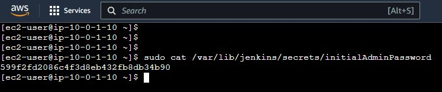

# DEPLOYMENT OF WEB APPLICATION TO AMAZON EKS THROUGH JENKINS CICD AND TERRAFROM AS IaC

Original owner @thanosdrome


***Welcome to this step-by-step guide on deploying an EKS cluster and application with complete CI/CD!***

Are you looking to streamline your application delivery process and automate your infrastructure deployment? Look no further! In this project, I'll take you through the process of setting up an EKS cluster, deploying an application, and creating a CI/CD pipeline using Jenkins and Terraform.

We'll start with the basics and gradually dive deeper into the technical details, so you'll find this guide helpful whether you're a beginner or an experienced DevOps engineer. By the end of this article, you'll have a fully functional EKS cluster and a simple containerized application up and running, with a CI/CD pipeline that automates the entire process from code to production.

## Let's get started and explore the world of EKS, CI/CD, and automation

## **What we'll build**

We are going to build and deploy a lot of things. Here is the outline for our project:

**I. Setting up Jenkins Server with Terraform**

* Creating an EC2 instance with Terraform.

* Installing necessary tools: `Java, Jenkins, AWS CLI, Terraform CLI, Docker, Sonar, Helm, Trivy, Kubectl`.

* Configuring Jenkins server.

**II. Creating EKS Cluster with Terraform**

* Writing Terraform configuration files for `EKS` cluster creation in a private subnet.

* Deploying EKS cluster using Terraform.

**III. Deploying NGinx Application with Kubernetes**

* Writing Kubernetes manifest files `(YAML)` for the NGinx application.

* Deploying NGinx application to `EKS` cluster.

**IV. Automating Deployment with Jenkins CI/CD**

* Creating `Jenkins` pipeline for automating EKS cluster creation and Nginx application deployment.

* Integrating Terraform and Kubernetes with the Jenkins pipeline.

* Configuring continuous integration and deployment (CI/CD).

## **What we'll need**

To embark on our CI/CD adventure, we'll need a trusty toolkit:

**Terraform** — To create configuration files for the EC2 instance which will be used as a Jenkins server and EKS Cluster in a VPC.

**Shell Script —** To install command line tools in the EC2 instance.

**Jenkins file —** To create a pipeline in the Jenkins Server.

**Kubernetes Manifest files** — To create a simple NGINX application in the EKS cluster.

## **Prerequisites**

Before creating and working with the project, let's set up some dev tools first -

1. It's better to have an IDE to develop your project. I am using `Visual Studio Code` for the same. You can install it from the following link based on the operating system— [https://code.visualstudio.com/download](https://code.visualstudio.com/download)

2. Install the CLI tools — [**AWS-CLI**](https://docs.aws.amazon.com/cli/latest/userguide/getting-started-install.html), and [**Terraform-CLI**](https://developer.hashicorp.com/terraform/tutorials/aws-get-started/install-cli).

3. Make sure you have an AWS Free Tier Account. And then create a user in IAM Console and finally create an `Access Key ID` and `Secret Access Key` in AWS Console for that user. You need to download these keys and then export those credentials in your terminal as follows —

```yaml
export AWS_ACCESS_KEY_ID=<Copy this from the credentials file downloaded>
export AWS_SECRET_ACCESS_KEY=<Copy this from the credentials file downloaded>
```

## **Stage 1: Configure and Build Jenkins Server**

The first thing we have to do is to create a new key pair for login into the EC2 instance and create an S3 bucket for storing terraform state files. This is the only manual step we are doing.

So, in the AWS management console go to "`EC2`" and select "`Key pairs`" in the listed overview of your resources, and then select "Create key pair" at the top right corner. You need to download these key pairs so that you can use them later for logging into the `EC2 instance`.


Create Key pairs for the EC2 instance

Next, let's create a `S3` bucket to store the terraform remote states. You can go ahead and do this manually. I have an existing s3 bucket used as remote backend in a CICD pipeline created using AWS Developer Tools.[AWS-CICD](https://github.com/chimezdev/palm-cicd-repo.git). So we will simply import that existing terraform configuration as follow.
In the ***backend.tf***
```yaml
data "terraform_remote_state" "aws-cicd" {
    backend = "s3"

    config = {
      bucket = "palm-terraform-remote-state"
      key = "palm-cicd/terraform.tfstate"
      region = "eu-west-1"
    }
}
```
You will see how we will make use of any resources from the state file when needed.


Create an S3 bucket to store terraform remote state

Now, let's start writing terraform configuration for our `EC2 instance` which will be used as a `Jenkins` server. So, we will create the instance first and then we will install the necessary tools like `jenkins` etc via a build script.

Here are the Terraform configuration files -
The rest of the ***backend.tf*** file

> *backend.tf*
```yaml
provider "aws" {
    region = var.aws_region  
}

terraform {
    required_providers {
    aws = {
        source = "hashcorp/aws"
        version = ">=5.25.0"
    }
  }
    backend "s3" {
        bucket = "palm-terraform-remote-state"
        key = "eks-jenkins/terraform.tfstate"
        dynamodb_table = "palm-terraform-locks"
        kms_key_id     = "arn:aws:kms:eu-west-1:038462750799:key/fbfc32d6-539b-4c81-bf58-d5db169b5322"
        region = "eu-west-1"
    }
}
```
Notice the ***kms key*** and ***dynamodb table***. They were created manually. The key is for encrypting the state file while is for terraform state LOCKING.

See the rest of the configuration files
> *data.tf*
see ***data.tf*** file

> *main.tf*
See the file ***jenkins-server/tf-aws-ec2/main.tf***
We'll be using publicly available modules for creating different services instead of resources
[None]https://registry.terraform.io/browse/modules?provider=aws

> *install\_build\_tools.sh*
- see the file **scripts/install_build_tools.sh**

Points to note before running `terraform apply`.

* Use the correct key pair name in the EC2 instance module `(main.tf)` and it must exist before creating the instance.

* Use the correct bucket name in the configuration for the `remote` backend `S3` in the`backend.tf`

* You need to use `user_data = file("scripts/install_build_tools.sh")` depending on your root module in the EC2 module to specify the script to be executed after EC2 instance creation.

* Make sure the script ***install_build_tools.sh*** is executable. Run `chmod +x install_build_tools.sh`

Let's run `terraform apply` and create this. Please make sure to run `terraform init` if you are doing this for the first time. Also, double-check your current working directory where you are running the `terraform cli` commands.

terraform apply


terraform apply

Give it some time before you go to the AWS `EC2 console` and check the instance status. Even though the instance is running, it may still be installing the tools.


Jenkins Build Server Created

Now, let's log in to the Jenkins server and verify if all the tools have been installed correctly or not.

So, let's select the `EC2 instance` and click on connect. You can simply connect using the **EC2 Instance connect**


successfully connected to the EC2 instance

We can now verify the versions of all the tools installed. Let's copy and paste the below commands.

```yaml
jenkins --version
docker --version
docker ps
terraform --version
kubectl version
aws --version
trivy --version
helm version
```

Here is the output.


Tools version installed in the Jenkins Server (EC2 instance)

Let's configure the Jenkins in the `EC2 instance`. So, copy the EC2 instance's `public IP address` and paste it into the browser by adding the `8080` port which we have provided in the security group settings for Jenkins.


Now, copy the administrator password from the below path and paste and continue.



Copy the Admin password

You will get the below screen. Click on `Install Suggested Plugins`**.**


Install Suggested Plugin


Plugin Installing

Once all the plugins are installed, you will be presented with the following screen. Here, you can continue as an admin (click on `skip and continue as admin`) **or** create a new user and password then click `Save and Continue`.


Create First Admin User
Click on `Save and Finish` and then on the next page `Start using Jenkins.`


Finally, you will get the below **Jenkins Dashboard**. At this point, we are ready with our Jenkins server. We'll configure the pipeline later.


Jenkins Dashboard
